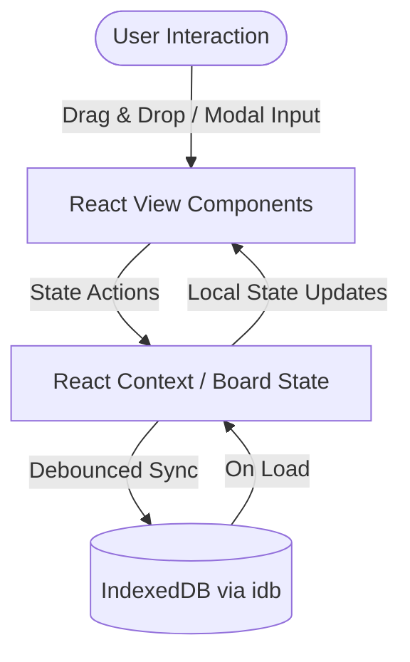

# Phase 1: Core Board & Local Persistence - Research

**Researched:** 2026-06-08
**Domain:** Next.js (React), Tailwind CSS v4, Hello Pangea DnD, IndexedDB local persistence
**Confidence:** HIGH

<user_constraints>
## User Constraints (from CONTEXT.md)

### Locked Decisions
- **D-01**: Aesthetic style is "Arknights-style," combining a simple purple color palette with street graffiti tags and tacticool/sci-fi visual elements.
- **D-02**: individual Kanban cards feature hybrid style: tactical/sci-fi framing (clean borders, corner bracket accents, small monospace status codes, and thin glowing outlines) combined with graffiti-style stickers/priority badges.
- **D-03**: Typography uses Monospace/Industrial fonts (e.g., *Share Tech Mono*) for data fields and status codes, paired with a bold geometric font (*Outfit* or *Inter*) for headers.
- **D-04**: Glow prominence is subtle and tactical (mild purple shadows on card hover, glowing indicator dots, and thin borders — not high-intensity ambient glow).

### the agent's Discretion
- Database Schema and IndexedDB storage keys structure.
- Drag-and-drop animation transitions, list-group mappings.
- Layout metrics (padding, gaps, card widths).

### Deferred Ideas (OUT OF SCOPE)
- None — discussion stayed within phase scope.
</user_constraints>

<architectural_responsibility_map>
## Architectural Responsibility Map

| Capability | Primary Tier | Secondary Tier | Rationale |
|------------|-------------|----------------|-----------|
| Next.js Scaffold | CDN/Static | Browser/Client | Next.js SSG/SSR setup for performance and base app architecture. |
| Board & Column Layout | Browser/Client | — | Responsive columns matching Arknights aesthetic. |
| Drag-and-Drop Interaction | Browser/Client | — | Client-side drag-and-drop handling with Hello Pangea DnD. |
| Card Modals & Custom Fields | Browser/Client | — | Interactive card configuration forms, checklists, and metadata editors. |
| IndexedDB Persistence | Browser/Client | Database/Storage | Offline-first client-side data persistence across reloads. |
</architectural_responsibility_map>

<research_summary>
## Summary

This research establishes the baseline architecture for the KanbanHarmo project. We are building a Next.js 15 application utilizing Tailwind CSS v4 and TypeScript. Styling will implement the custom "Arknights-style" dark tactical UI featuring purple accents, bracketed frames, monospace codes, and graffiti stickers.

For drag-and-drop, `@hello-pangea/dnd` is the standard React 18/19 compatible replacement for `react-beautiful-dnd`. For local storage persistence, the `idb` package provides a clean, modern Promise-based interface over vanilla IndexedDB, allowing us to store complete board state snapshots and load them synchronously on initialization.

**Primary recommendation:** Initialize the Next.js app in the root directory, configure Tailwind CSS v4 to include custom fonts and colors, implement a dedicated IndexedDB database client wrapper using `idb`, and design columns and cards with semantic HTML, CSS-based brackets, and framer-motion micro-animations.
</research_summary>

<standard_stack>
## Standard Stack

### Core
| Library | Version | Purpose | Why Standard |
|---------|---------|---------|--------------|
| next | ^15.0.0 | Core App Router Framework | Industry standard full-stack React framework. |
| tailwindcss | ^4.0.0 | Styling Framework | Standard utility-first styling with modern features and CSS variables. |
| @hello-pangea/dnd | ^18.0.0 | Drag & Drop | React 18/19 compatible fork of react-beautiful-dnd. |
| idb | ^8.0.0 | IndexedDB Wrapper | Promise-based IndexedDB wrapper with full TS support. |

### Supporting
| Library | Version | Purpose | When to Use |
|---------|---------|---------|-------------|
| lucide-react | ^0.450.0 | UI Icons | For checklist status, priorities, tags, edit, delete icons. |
| framer-motion | ^11.11.0 | Micro-animations | For smooth drawer expansions, hover glow, and card transitions. |

### Alternatives Considered
| Instead of | Could Use | Tradeoff |
|------------|-----------|----------|
| @hello-pangea/dnd | dnd-kit | dnd-kit is highly modular but has a steep learning curve and doesn't provide standard vertical lists as out-of-the-box as hello-pangea/dnd. |
| idb | localStorage | localStorage is blocking and limited to 5MB; IndexedDB via `idb` is async, non-blocking, and supports much larger data capacity. |

**Installation:**
```bash
npx -y create-next-app@latest ./ --typescript --eslint --tailwind --app --src-dir --import-alias "@/*" --use-npm
npm install @hello-pangea/dnd idb lucide-react framer-motion
```
</standard_stack>

<architecture_patterns>
## Architecture Patterns

### System Architecture Diagram


### Recommended Project Structure
```
src/
├── app/
│   ├── layout.tsx         # Global styles and font definitions
│   └── page.tsx           # Dashboard main board view
├── components/
│   ├── Board.tsx          # Column container and DnD DragDropContext
│   ├── Column.tsx         # Droppable area with Column Title CRUD
│   ├── Card.tsx           # Draggable task cards with Arknights frame styling
│   └── CardModal.tsx      # Checklist, priority, dates, and custom fields
├── lib/
│   └── db.ts              # idb helper client for board state saving/loading
└── types/
    └── index.ts           # Shared board, column, card, subtask types
```

### Pattern 1: IndexedDB State Persistence
```typescript
import { openDB, IDBPDatabase } from 'idb';

export interface BoardState {
  columns: any[];
  cards: any[];
}

const DB_NAME = 'kanban-harmo-db';
const STORE_NAME = 'board-store';

export async function getDB(): Promise<IDBPDatabase> {
  return openDB(DB_NAME, 1, {
    upgrade(db) {
      if (!db.objectStoreNames.contains(STORE_NAME)) {
        db.createObjectStore(STORE_NAME);
      }
    },
  });
}

export async function saveBoardState(state: BoardState): Promise<void> {
  const db = await getDB();
  await db.put(STORE_NAME, state, 'current-board');
}

export async function loadBoardState(): Promise<BoardState | null> {
  const db = await getDB();
  return db.get(STORE_NAME, 'current-board');
}
```

### Pattern 2: Hello Pangea DnD Handler
```typescript
import { DragDropContext, Droppable, Draggable } from '@hello-pangea/dnd';

function onDragEnd(result: any) {
  const { destination, source, draggableId } = result;
  if (!destination) return;
  if (
    destination.droppableId === source.droppableId &&
    destination.index === source.index
  ) return;
  
  // Reorder state logic...
}
```

### Anti-Patterns to Avoid
- **Saving state on every keystroke:** Do not trigger IndexedDB writes for every keypress in input modals. Debounce persistence or write on modal blur/close to avoid locking the main thread.
- **Next.js Hydration Mismatch on Drag & Drop:** `@hello-pangea/dnd` relies on window and client-side rendering. Use dynamic imports or `useEffect` to ensure rendering only occurs on the client to avoid hydration errors.
</architecture_patterns>

<dont_hand_roll>
## Don't Hand-Roll

| Problem | Don't Build | Use Instead | Why |
|---------|-------------|-------------|-----|
| Drag-and-Drop | Custom pointer event trackers | `@hello-pangea/dnd` | Hand-rolled drag-and-drop lacks screen-reader accessibility, keyboard navigation, and robust collision detection. |
| IndexedDB connection | Raw indexdb requests | `idb` | Vanilla IndexedDB API uses complex callback/event listener code; `idb` wraps it in clean promises. |
| Iconography | SVG paths | `lucide-react` | Standardizing icons keeps UI consistent and simplifies updates. |
</dont_hand_roll>

<common_pitfalls>
## Common Pitfalls

### Pitfall 1: Hydration Mismatch with DnD
**What goes wrong:** Next.js Server-Side Rendering output differs from client output, causing rendering inconsistencies or crash.
**Why it happens:** `@hello-pangea/dnd` generates client-side IDs and checks DOM mounts.
**How to avoid:** Wrap the Board or Droppable container in a client-only mounting check (e.g., render only when `isMounted` is true via `useEffect`).
**Warning signs:** Console warnings like "Prop `aria-describedby` did not match...".

### Pitfall 2: LocalStorage Sync Latency
**What goes wrong:** Board shows old state on fast page reload.
**Why it happens:** Blocked writes or data corruption.
**How to avoid:** Use IndexedDB with Promise verification.
</common_pitfalls>

<code_examples>
## Code Examples

### Arknights Tacticool Frame (CSS Variable Style)
```css
/* Custom tactical corner borders in Tailwind CSS v4 */
.tacticool-card {
  position: relative;
  border: 1px solid var(--color-purple-900);
  background: rgba(20, 10, 30, 0.85);
  box-shadow: 0 0 10px rgba(168, 85, 247, 0.1);
  transition: all 0.3s cubic-bezier(0.4, 0, 0.2, 1);
}
.tacticool-card:hover {
  box-shadow: 0 0 15px rgba(168, 85, 247, 0.35);
  border-color: var(--color-purple-500);
}
.tacticool-card::before, .tacticool-card::after {
  content: '';
  position: absolute;
  width: 6px;
  height: 6px;
  border-color: var(--color-purple-400);
  border-style: solid;
}
/* Top-left corner bracket */
.tacticool-card::before {
  top: -1px;
  left: -1px;
  border-width: 1px 0 0 1px;
}
/* Bottom-right corner bracket */
.tacticool-card::after {
  bottom: -1px;
  right: -1px;
  border-width: 0 1px 1px 0;
}
```
</code_examples>

<sota_updates>
## State of the Art (2024-2025)

| Old Approach | Current Approach | When Changed | Impact |
|--------------|------------------|--------------|--------|
| react-beautiful-dnd | @hello-pangea/dnd | 2023 | Maintains compatibility with modern React (18+) and Next.js. |
| Tailwind CSS v3 | Tailwind CSS v4 | 2024 | Native CSS configuration, improved performance, direct custom font loading. |
</sota_updates>

<open_questions>
## Open Questions

1. **How should we handle the default board seed state?**
   - Recommendation: If IndexedDB is empty on first load, seed with three columns ("Todo", "In Progress", "Done") and a sample card introducing the board features.
</open_questions>

<sources>
## Sources

### Primary (HIGH confidence)
- Hello Pangea GitHub Repo - https://github.com/hello-pangea/dnd
- Next.js 15 App Router Docs - https://nextjs.org/docs
- idb GitHub Repository - https://github.com/jakearchibald/idb

### Secondary (MEDIUM confidence)
- Tailwind CSS v4 documentation on native variables and custom fonts.
</sources>

<metadata>
## Metadata

**Research scope:**
- Core technology: Next.js 15, Tailwind v4
- Ecosystem: hello-pangea/dnd, idb
- Patterns: IndexedDB store, tacticool UI frames

**Confidence breakdown:**
- Standard stack: HIGH
- Architecture: HIGH
- Pitfalls: HIGH
- Code examples: HIGH

**Research date:** 2026-06-08
**Valid until:** 2026-07-08
</metadata>

---

*Phase: 01-core-board-local-persistence*
*Research completed: 2026-06-08*
*Ready for planning: yes*
