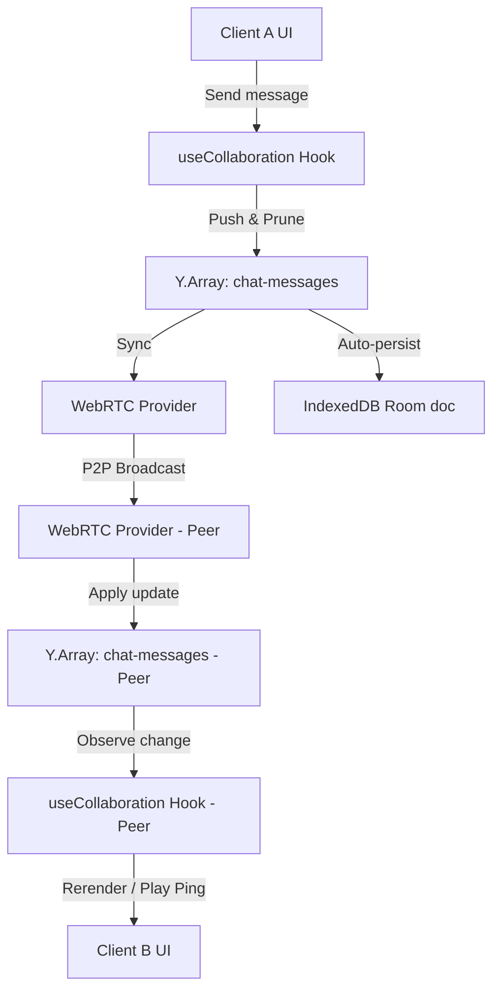

# Phase 8: Room-level Real-time Chat - Research

**Researched:** 2026-06-09
**Domain:** Real-time P2P Collaboration, Yjs Shared State, Chat Messaging
**Confidence:** HIGH

## Summary

This phase implements a slide-out Chat Drawer for collaborative rooms using the existing Yjs and WebRTC architecture. It enables peers to chat in real-time within the connected room. Messages are synchronized using a `Y.Array` on the room document, capped at a rolling 100-message buffer for optimal performance. Unread message badges, minimalist beep/flash ping animations, system join/leave events, and auto-linking are also supported. The chat drawer will persist its open/closed state across Kanban, Gantt, and Analytics views.

**Primary recommendation:** Integrate `yChatArray` into `useCollaboration.ts` as a synchronized `Y.Array` named `"chat-messages"`, using Yjs transactions to perform atomic message addition and rolling pruning to exactly 100 entries.

## Architectural Responsibility Map

| Capability | Primary Tier | Secondary Tier | Rationale |
|------------|-------------|----------------|-----------|
| Chat Message Sync | Client (Yjs) | P2P WebRTC | Peer messages are synchronized via client-side CRDTs and transmitted directly via WebRTC |
| Message Persistence | Client (IndexedDB) | — | Offline chat logs are loaded locally from `y-indexeddb` |
| Rolling Window Pruning | Client (Yjs transaction) | — | Oldest messages are deleted on the sending client in a single Yjs transaction |
| UI & Transitions | Client (React/Framer Motion) | — | Smooth side drawer slider and flash ping animation |

## Standard Stack

### Core
| Library | Version | Purpose | Why Standard |
|---------|---------|---------|--------------|
| yjs | ^13.6.31 | Shared state CRDTs | Project's chosen standard for concurrent editing |
| y-webrtc | ^10.3.0 | WebRTC connection provider | Connects peers serverlessly |
| y-indexeddb | ^9.0.12 | Local persistence | Automatically saves Y.Doc updates locally |

### Supporting
| Library | Version | Purpose | When to Use |
|---------|---------|---------|-------------|
| framer-motion | ^12.40.0 | Drawer transitions & alert animations | Slide-out drawers and tactical flash pings |
| lucide-react | ^1.17.0 | Icons | Chat, message, close, and warning icons |

### Alternatives Considered
| Instead of | Could Use | Tradeoff |
|------------|-----------|----------|
| Y.Array | Y.Map (with uuid keys) | `Y.Array` is simpler for ordered message streams and makes rolling deletions by index trivial. |

**Installation:** No new packages are needed. All packages are already present in `package.json`.

## Package Legitimacy Audit

No new external packages are installed. Existing dependencies are used.

## Architecture Patterns

### System Architecture Diagram



### Recommended Project Structure
```
src/
├── components/
│   ├── ChatDrawer.tsx      # Slide-out chat drawer UI
│   └── ...
├── hooks/
│   └── useCollaboration.ts # Modified to manage chat state
└── ...
```

### Pattern 1: Atomic Push and Prune Yjs Transaction
**What:** Writing to the Y.Array and pruning excess items in a single transaction ensures that only one synced update is sent to peers.
**When to use:** Whenever adding items to a bounded shared list.
**Example:**
```typescript
// Source: https://docs.yjs.dev
doc.transact(() => {
  yArray.push([newMessage]);
  if (yArray.length > 100) {
    yArray.delete(0, yArray.length - 100);
  }
});
```

### Anti-Patterns to Avoid
- **Pruning outside transaction:** Avoid deleting elements from `Y.Array` in separate update loops, which generates multiple document update events and wastes network bandwidth.
- **Polling IndexedDB:** Avoid querying IndexedDB directly for new messages; let `y-indexeddb` handle background persistence and rely entirely on the Yjs `observe` listeners for reactivity.

## Don't Hand-Roll

| Problem | Don't Build | Use Instead | Why |
|---------|-------------|-------------|-----|
| Chat Persistence | Custom IndexedDB schema | y-indexeddb | `y-indexeddb` already syncs the entire Y.Doc including the chat array, preventing duplicate persistence logic. |

## Common Pitfalls

### Pitfall 1: Message duplication during initial room sync
**What goes wrong:** Peers joining a room might re-apply historical updates, creating duplicate system logs or message entries if not careful.
**Why it happens:** Yjs handles insertions by unique user/client IDs, but if identifiers are regenerated or messages lack unique IDs, they might appear twice.
**How to avoid:** Ensure every message has a unique client-generated UUID (`id`) and the render loop uses `message.id` as the React `key`, filtering or deduplicating messages based on their unique ID if needed.

## Code Examples

### Observing Shared Array changes reactively
```typescript
// Source: https://docs.yjs.dev
const yChatArray = doc.getArray<ChatMessage>("chat-messages");
const observer = () => {
  setChatMessages(yChatArray.toArray());
};
yChatArray.observe(observer);
```

## State of the Art

| Old Approach | Current Approach | When Changed | Impact |
|--------------|------------------|--------------|--------|
| Centralized DB chat sockets | CRDT-based P2P shared list | Yjs v13 | Complete serverless communication with instant sync |

## Assumptions Log

| # | Claim | Section | Risk if Wrong |
|---|-------|---------|---------------|
| A1 | Custom signaling server is not needed for chat | Summary | WebRTC signaling fallback on public servers is sufficient for message passing |

## Open Questions

None. The decisions in CONTEXT.md completely cover the requirements.

## Environment Availability

| Dependency | Required By | Available | Version | Fallback |
|------------|------------|-----------|---------|----------|
| Node.js | Runtime | ✓ | 20+ | — |
| Yjs | CRDT State | ✓ | 13.6.31 | — |
